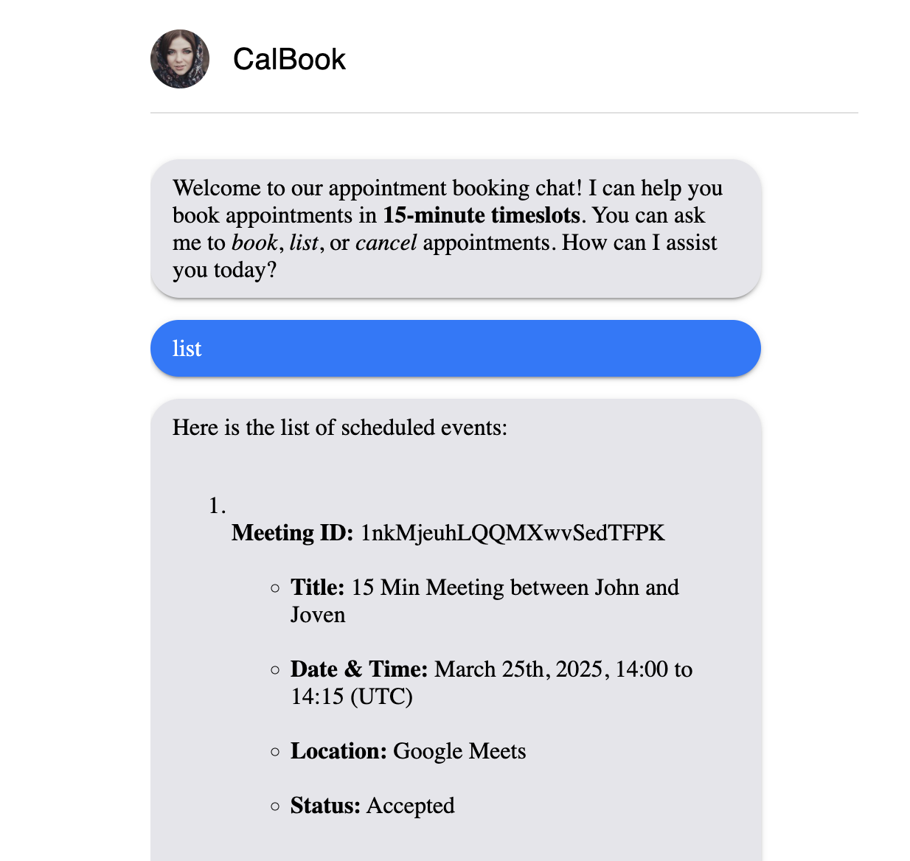

# 🗓️ Calendar Agent

An AI-powered chat interface for managing calendar bookings. Built with **React**, **FastAPI**, and OpenAI's GPT models, it lets users interact naturally to:

- 📅 List, book, or cancel meetings
- 🤖 Chat with an assistant
- ✨ View animated typing bubbles for a smoother experience

---

## 🚀 Features

- **Natural language chat UI**
- **FastAPI backend with OpenAI API integration**
- **Animated typing indicator**
- **Persistent chat bubbles**
- **CORS support for local frontend/backend setup**

---

## 📷 Screenshot

 <!-- Save your uploaded image as screenshot.png in root if needed -->

---

## 🛠️ Technologies

- React (frontend)
- MUI (Material UI components)
- FastAPI (backend)
- OpenAI API (chat assistant)

---

## 🚀 How to Run

1. **Go into the frontend folder**

   cd frontend

2. **Install frontend dependencies**

   npm install

3. **Run the React app**

   - For production build: `npm run build`  
   - For development: `npm start`

4. **Go into the backend folder**

   cd ../backend

5. **Install backend dependencies**

   pip install -r requirements.txt

6. **Set up your environment variables**

   Create a `.env` file inside the `backend` folder and add:

    OPENAI_API_KEY=
    CAL_API_KEY=
    PORT=

7. **Run the FastAPI backend**

   uvicorn app:app --host 0.0.0.0 --port 8000 --reload

